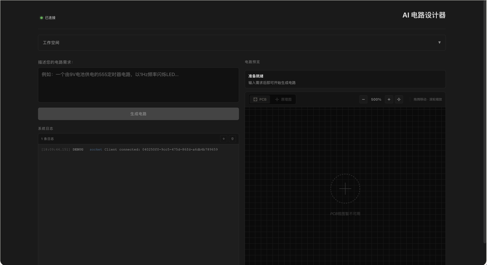
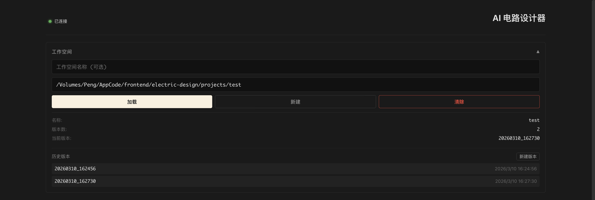

# Electric Design

<p align="center">
  <strong>一个基于 Bun、React、tscircuit 与 KiCad 工作流的开源电路设计自动化项目。</strong>
</p>

<p align="center">
  Electric Design 将生成、编译、转换、校验、导出与下载整合为统一的 Web 化工具链。
</p>

<p align="center">
  <a href="./README.md">English</a> | <strong>简体中文</strong>
</p>

<p align="center">
  
  
  
  
  
  
</p>

---

## 目录

- [项目简介](#项目简介)
- [界面示例](#界面示例)
- [功能特性](#功能特性)
- [工作空间](#工作空间)
- [架构概览](#架构概览)
- [技术栈](#技术栈)
- [项目结构](#项目结构)
- [快速开始](#快速开始)
- [可用脚本](#可用脚本)
- [API 概览](#api-概览)
- [开发说明](#开发说明)
- [文档索引](#文档索引)
- [路线图](#路线图)
- [贡献指南](#贡献指南)
- [许可证](#许可证)

---

## 项目简介

Electric Design 是一个面向电路设计自动化的开源项目，构建于 `Bun`、`React`、`tscircuit` 生态以及 KiCad 相关工具链之上。

它的目标是支持这样一条端到端流程：

`输入 → 生成 → 编译 → 转换 → 校验 → 导出 → 下载`

当前仓库已经具备以下基础能力：

- 可运行的后端服务结构
- 控制台风格的前端界面
- 面向 KiCad 的校验与导出流程
- 基于本地文件系统的工作空间与版本管理
- 围绕核心处理链路的测试与调试脚本

### 项目目标

- 将用户输入转换为可执行的电路描述
- 将电路定义编译为可处理的中间数据
- 将结果转换为 KiCad 可兼容产物
- 对设计执行规则校验与检查
- 导出 Gerber、BOM 等面向生产的交付文件
- 将生成结果持久化到本地工作空间并支持完整版本历史
- 提供统一的 Web 化工作流入口

---

## 界面示例

### 示例截图




---

## 功能特性

### 当前已具备的能力

- 基于 Bun 的 HTTP 服务
- React 前端应用
- WebSocket 支持
- 电路生成接口
- 编译与转换接口
- KiCad 校验接口
- Gerber 与 BOM 导出接口
- 文件下载接口
- **工作空间管理** — 基于本地文件系统的工作空间，支持电路结果版本化存储
- 面向 KiCad 校验流程的测试覆盖
- 内部日志与 pipeline 调试文档

### 已覆盖的工作流阶段

- 文本或代码输入
- 电路生成
- 电路编译
- KiCad 转换
- ERC / DRC 校验
- Gerber / BOM 导出
- 工作空间保存与版本历史
- 结果文件下载

---

## 工作空间

工作空间系统是 Electric Design 的核心功能之一。它将生成的电路结果持久化到本地磁盘目录，以版本历史的形式组织存储。这使你可以迭代电路设计、对比不同版本，并随时恢复历史状态。

### 核心概念

| 概念 | 说明 |
|---|---|
| **工作空间 (Workspace)** | 本地磁盘上的一个目录，用于存储电路设计结果和元数据 |
| **版本 (Version)** | 电路的一次保存状态，以时间戳为 ID（例如 `20260310_143052`） |
| **当前版本 (Current Version)** | 最近一次签出或保存的版本 |
| **meta.json** | 工作空间的索引文件，存储于 `<workspace>/.eai/meta.json` |

### 目录结构

当工作空间初始化到 `/path/to/my-circuit` 时，会创建如下结构：

```text
/path/to/my-circuit/
├── .eai/
│   ├── meta.json              # 工作空间元数据与版本索引
│   └── versions/
│       ├── 20260310_143052/
│       │   └── code.tsx       # 该版本的电路生成代码
│       └── 20260310_150412/
│           └── code.tsx
├── project.kicad_pcb          # KiCad PCB 文件（每次保存/签出时覆盖）
└── project.kicad_sch          # KiCad 原理图文件（每次保存/签出时覆盖）
```

### 工作空间元数据（`meta.json`）

```json
{
  "name": "my-circuit",
  "createdAt": 1741600000000,
  "lastModified": 1741603200000,
  "currentVersion": "20260310_150412",
  "versions": [
    {
      "id": "20260310_143052",
      "prompt": "一个由 9V 电池供电的 555 定时器电路，以 1Hz 频率闪烁 LED",
      "codeFile": ".eai/versions/20260310_143052/code.tsx",
      "timestamp": 1741600000000,
      "isValid": true
    },
    {
      "id": "20260310_150412",
      "prompt": "一个由 9V 电池供电的 555 定时器电路，以 1Hz 频率闪烁 LED",
      "codeFile": ".eai/versions/20260310_150412/code.tsx",
      "timestamp": 1741603200000,
      "isValid": true
    }
  ]
}
```

### 工作空间 UI（`WorkspaceSelector`）

`WorkspaceSelector` 组件嵌入在主控制台界面中，提供以下交互能力：

- **路径输入** — 输入本地目录的绝对路径作为工作空间
- **名称输入** — 可选的工作空间显示名称（默认取目录名）
- **加载** — 从磁盘加载已有工作空间，显示元数据和版本历史
- **新建** — 在指定路径初始化一个全新的工作空间（创建 `.eai/` 目录结构）
- **清除** — 从 UI 会话中解绑当前工作空间（不会删除磁盘上的文件）
- **版本列表** — 按时间顺序展示所有已保存版本，附带时间标签
- **新建版本** — 重置当前活跃版本指针，使下次生成保存为新版本
- **点击版本** — 点击任意版本可进行签出：加载其代码、重新编译并更新预览

### 工作空间 API 接口

所有工作空间操作均通过 `/api/workspace` 暴露。

#### `POST /api/workspace` — 初始化或加载工作空间

在指定路径初始化新工作空间，若已存在则直接返回其元数据。

**请求体：**

```json
{
  "path": "/path/to/workspace",
  "name": "可选的显示名称"
}
```

**响应：**

```json
{
  "success": true,
  "data": { /* WorkspaceMeta */ }
}
```

---

#### `GET /api/workspace` — 读取工作空间元数据或版本代码

**查询参数：**

| 参数 | 必填 | 说明 |
|---|---|---|
| `path` | 是 | 工作空间目录的绝对路径 |
| `versionId` | 否 | 若提供，则返回该版本的源代码 |

**响应（元数据）：**

```json
{
  "success": true,
  "data": { /* WorkspaceMeta */ }
}
```

**响应（版本代码）：**

```json
{
  "success": true,
  "data": {
    "versionId": "20260310_143052",
    "code": "/* 电路 TSX 源代码 */"
  }
}
```

---

#### `PUT /api/workspace` — 将生成结果保存到工作空间

将生成的代码和 KiCad 文件保存为新版本，或更新已有版本。

**请求体：**

```json
{
  "path": "/path/to/workspace",
  "code": "/* 电路 TSX 源代码 */",
  "prompt": "一个以 1Hz 频率闪烁 LED 的 555 定时器电路",
  "kicadFiles": {
    "pcb": "/* KiCad PCB 文件内容 */",
    "sch": "/* KiCad 原理图文件内容 */"
  },
  "timestamp": 1741600000000,
  "isValid": true,
  "versionId": "20260310_143052"
}
```

> `versionId` 为可选字段。若提供，则原地更新该版本；若省略，则创建新版本。

**响应：**

```json
{
  "success": true,
  "versionId": "20260310_143052",
  "data": { /* WorkspaceMeta */ }
}
```

---

#### `PATCH /api/workspace` — 签出版本或更新版本代码

通过 `action` 字段支持两种操作。

**操作：`checkout`** — 切换到历史版本，将该版本的 KiCad 文件写入工作空间根目录。

```json
{
  "path": "/path/to/workspace",
  "action": "checkout",
  "versionId": "20260310_143052"
}
```

**操作：`update-code`** — 覆盖已有版本的源代码（用于错误修复流程）。

```json
{
  "path": "/path/to/workspace",
  "action": "update-code",
  "versionId": "20260310_143052",
  "code": "/* 修正后的电路 TSX 源代码 */",
  "isValid": false
}
```

**响应：**

```json
{
  "success": true,
  "data": {
    "versionId": "20260310_143052",
    "meta": { /* WorkspaceMeta */ }
  }
}
```

---

#### `DELETE /api/workspace` — 删除版本

**查询参数：**

| 参数 | 必填 | 说明 |
|---|---|---|
| `path` | 是 | 工作空间目录的绝对路径 |
| `versionId` | 是 | 要删除的版本 ID |

**响应：**

```json
{
  "success": true,
  "data": { "meta": { /* WorkspaceMeta */ } }
}
```

> 若被删除的版本恰好是当前版本，工作空间会自动回退到最近的剩余版本。

---

### 工作空间感知的生成流程

当工作空间处于激活状态时，`ConsoleInterface` 中的 `handleSubmit` 会改变执行逻辑：

1. `POST /api/generate` — 根据用户输入的 prompt 生成电路代码
2. `POST /api/export` — 在一次调用中完成编译、转换、校验，并将结果保存到工作空间（传入 `workspace` 路径和可选的 `versionId`）
3. 返回的 `versionId` 存入组件状态，`WorkspaceSelector` 刷新以展示新版本

未启用工作空间时，流程仅调用 `POST /api/compile-and-convert`，不进行任何持久化。

### `FileManager` 类

后端工作空间逻辑由 `src/lib/file-manager.ts` 中的 `FileManager` 类实现。核心方法如下：

| 方法 | 说明 |
|---|---|
| `init(options)` | 创建 `.eai/` 目录结构，写入初始 `meta.json` |
| `getMeta()` | 读取并解析 `meta.json` |
| `updateMeta(updater)` | 对 `meta.json` 应用变换函数并写回 |
| `createVersion(options)` | 创建新版本目录，写入 `code.tsx`，更新 `meta.json` |
| `saveGeneratedResult(options)` | 创建新版本或更新已有版本 |
| `checkoutVersion(versionId)` | 写入指定版本的 KiCad 文件并设为当前版本 |
| `deleteVersion(versionId)` | 删除版本文件并更新 `meta.json` |
| `readVersionCode(versionId)` | 读取指定版本的 `code.tsx` 源代码 |
| `updateVersionCode(versionId, code, isValid)` | 覆盖指定版本的 `code.tsx` |
| `writeKiCadFiles(pcb, sch)` | 将 `project.kicad_pcb` 和 `project.kicad_sch` 写入工作空间根目录 |
| `exists()` | 检查工作空间是否已初始化（即 `meta.json` 是否存在） |

---

## 架构概览

仓库整体按服务化流程组织：

1. **前端 UI** 接收用户输入并展示处理结果
2. **路由层** 提供生成、编译、校验、导出、工作空间、下载等 HTTP API
3. **服务层** 实现核心业务逻辑
4. **`FileManager`** 负责工作空间持久化与版本管理（本地文件系统）
5. **KiCad 相关工具** 用于校验和制造产物输出
6. **测试与调试脚本** 用于验证 CLI 可用性与 pipeline 行为

从高层看，项目遵循以下流程：

- 输入采集
- 电路生成
- 电路编译
- KiCad 转换
- 设计校验
- 导出处理
- 工作空间保存 / 版本管理
- 产物下载

---

## 技术栈

### 运行时与平台

- `Bun`
- `TypeScript`
- `React 19`
- `Bun.serve()`

### 电路与转换生态

- `@tscircuit/core`
- `@tscircuit/eval`
- `@tscircuit/checks`
- `circuit-json`
- `circuit-to-svg`
- `circuit-json-to-kicad`
- `kicad-converter`
- `bun-match-svg`

### 工程化工具

- `Biome`
- `Stylelint`
- `bun test`

---

## 项目结构

```text
electric-design/
├── src/
│   ├── components/
│   │   ├── ConsoleInterface.tsx   # 主界面：prompt 输入、预览、工作空间集成
│   │   ├── WorkspaceSelector.tsx  # 工作空间加载/初始化/清除/版本管理 UI
│   │   ├── LogViewer.tsx          # 实时日志展示
│   │   └── SchematicViewer.tsx    # 基于 SVG 的电路预览
│   ├── examples/       # 示例与样例资源
│   ├── hooks/          # React Hooks（如 use-socket.ts）
│   ├── lib/
│   │   ├── file-manager.ts        # FileManager：工作空间与版本持久化
│   │   ├── config.ts              # 应用配置
│   │   ├── logger.ts              # 内部结构化日志
│   │   ├── socket-manager.ts      # WebSocket 连接管理
│   │   └── source-utils.ts        # 源代码工具函数
│   ├── routes/
│   │   ├── workspace.ts           # GET/POST/PUT/PATCH/DELETE /api/workspace
│   │   ├── generate.ts            # POST /api/generate
│   │   ├── compile.ts             # POST /api/compile
│   │   ├── convert.ts             # POST /api/convert
│   │   ├── compile-and-convert.ts # POST /api/compile-and-convert
│   │   ├── export.ts              # POST /api/export
│   │   ├── validate-kicad.ts      # KiCad 校验与导出路由
│   │   └── download.ts            # 下载路由
│   ├── services/       # 生成 / 编译 / 转换 / 校验核心逻辑
│   ├── types/
│   │   ├── workspace.ts           # WorkspaceMeta、WorkspaceVersion 等类型定义
│   │   ├── ai.ts
│   │   ├── errors.ts
│   │   ├── kicad.ts
│   │   └── tscircuit.ts
│   ├── util/           # 通用工具函数
│   ├── web/            # Web 相关资源
│   ├── App.tsx         # 前端主应用组件
│   ├── frontend.tsx    # React 入口
│   ├── index.html      # HTML 入口
│   └── index.ts        # Bun 服务入口
├── tests/
│   ├── unit/           # 单元测试
│   ├── integration/    # 集成测试
│   ├── examples/       # 示例驱动测试
│   └── output/         # 测试输出产物
├── docs/               # 补充文档
├── dist/               # 构建产物
├── images/             # README 图片资源
├── AGENTS.md
├── CLAUDE.md
├── LICENSE
├── package.json
├── bunfig.toml
├── tsconfig.json
├── README.md
└── README.zh-CN.md
```

---

## 快速开始

## 环境要求

建议使用以下环境：

- `Bun 1.3+`
- `KiCad CLI`（用于 ERC / DRC / 导出相关能力）
- macOS 或 Linux

## 安装依赖

```sh
bun install
```

## 启动开发环境

```sh
bun run dev
```

这会以开发模式启动应用，并启用基于 Bun 服务端的热更新能力。

## 构建生产版本

```sh
bun run build
```

构建输出目录为：

- `dist/`

## 启动生产环境

```sh
bun run start
```

## 运行测试

```sh
bun test
```

或者使用项目脚本：

```sh
bun run test
```

---

## 可用脚本

当前 `package.json` 中提供了以下脚本：

- `bun run dev` — 启动开发服务器
- `bun run build` — 构建生产资源
- `bun run start` — 启动生产服务
- `bun run test` — 运行测试
- `bun run test:watch` — 监听模式测试
- `bun run test:coverage` — 测试覆盖率
- `bun run lint` — 执行 TypeScript 与 CSS 检查
- `bun run lint:fix` — 自动修复可处理的 lint 问题
- `bun run format` — 格式化代码
- `bun run format:check` — 检查格式
- `bun run type-check` — 执行 TypeScript 类型检查

### 建议执行的质量检查

```sh
bun run lint
bun run format:check
bun run type-check
```

### 自动修复格式与部分问题

```sh
bun run lint:fix
bun run format
```

---

## API 概览

当前服务端已暴露以下主要接口：

### 基础接口

- `GET /api/hello`
- `PUT /api/hello`
- `GET /api/hello/:name`

### 工作流接口

- `POST /api/generate`
- `POST /api/compile`
- `POST /api/convert`
- `POST /api/compile-and-convert`
- `POST /api/export`

### 工作空间接口

- `POST /api/workspace` — 初始化或加载工作空间
- `GET /api/workspace` — 读取工作空间元数据或指定版本的代码
- `PUT /api/workspace` — 保存生成结果（创建或更新版本）
- `PATCH /api/workspace` — 签出版本或更新版本代码
- `DELETE /api/workspace` — 删除版本

### KiCad 校验与导出接口

- `POST /api/validate-kicad`
- `POST /api/check-kicad`
- `POST /api/export-gerber`
- `POST /api/export-bom`
- `POST /api/auto-fix-validation`

### 下载接口

- `POST /api/download-kicad`
- `POST /api/download-schematic`
- `POST /api/download-gerbers`
- `POST /api/download-bom`

### WebSocket 接口

- `GET /ws`

> 非工作空间接口的完整请求/响应文档将随接口稳定后持续补充。工作空间接口的详细说明请参阅上方 [工作空间](#工作空间) 章节。

---

## 开发说明

### 优先使用 Bun

本仓库默认以 Bun 作为核心运行时与工具链，建议优先使用：

- `bun install`
- `bun run <script>`
- `bun test`
- `bunx <package>`

### 依赖 KiCad CLI 的能力

部分流程依赖本地可用的 KiCad CLI。如果校验或导出功能异常，优先检查：

- `kicad-cli` 是否已安装
- 是否已正确加入 `PATH`
- 当前环境是否具备执行权限

### 工作空间持久化

工作空间系统直接将文件写入本地文件系统，不依赖任何数据库。工作空间路径下的 `.eai/` 子目录完全由 `FileManager` 管理。除非你熟悉版本索引格式，否则请勿手动编辑 `meta.json`。

工作空间根目录下的 KiCad 文件（`project.kicad_pcb`、`project.kicad_sch`）在每次保存或签出版本时都会被覆盖，始终反映当前版本的状态。

### 当前项目成熟度

根据当前仓库结构，可以认为：

- 后端与服务流程相对完整
- 核心 pipeline 已覆盖多个关键阶段，包括工作空间版本化
- 前端目前更接近控制台 / 工作台形态，而非最终产品化 UI
- 测试与内部文档对理解项目行为非常重要

---

## 文档索引

仓库内还包含以下补充文档：

- `README.md` — English documentation
- `README.zh-CN.md` — 中文文档
- `AGENTS.md`
- `CLAUDE.md`
- `docs/CI.md`
- `docs/DOWNLOAD_FIX.md`
- `docs/FIX_SUMMARY.md`
- `docs/LOGGING.md`
- `docs/PROMPT_IMPROVEMENT_PLAN.md`
- `docs/架构.md`

如果你是第一次阅读这个仓库，推荐顺序如下：

1. `README.md`
2. `README.zh-CN.md`
3. `AGENTS.md`
4. `docs/架构.md`
5. `docs/LOGGING.md`
6. `src/lib/file-manager.ts`
7. `src/routes/workspace.ts`
8. `tests/kicad-validator.test.ts`

---

## 路线图

项目后续可以重点完善以下方向：

- 更完整的前端交互界面
- 更稳定的 AI 辅助生成策略
- 更丰富的模板与示例电路
- 更强的校验与自动修复流程
- 工作空间版本 diff 视图
- 工作空间导出与分享支持
- 预览、历史记录与任务管理能力
- 更完善的 CI/CD 与发布流程
- 更完整的 API 文档
- 公共演示环境部署说明

---

## 贡献指南

欢迎贡献。

如果你希望参与贡献，建议按照以下流程进行：

1. Fork 仓库
2. 创建功能分支
3. 保持改动聚焦且清晰
4. 在本地运行 lint、format、type-check 与 test
5. 提交带有清晰说明的 Pull Request

### 提交前建议本地执行

```sh
bun run lint
bun run format:check
bun run type-check
bun run test
```

### 当前特别欢迎的贡献方向

- 前端体验优化
- API 文档补充
- 测试覆盖增强
- 校验/导出流程鲁棒性提升
- 工作空间版本 diff 与历史可视化
- pipeline 可观测性建设
- 示例电路与模板扩展

---

## 许可证

本项目使用 [MIT License](./LICENSE)。

这意味着你可以：

- 商业使用
- 修改代码
- 分发代码
- 私人使用

你需要保留原始版权声明和许可证文本。

如需查看完整许可证内容，请参考仓库根目录下的 `LICENSE` 文件。
