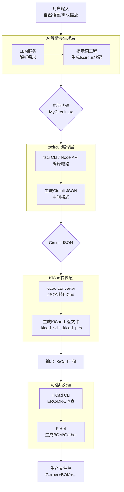

# AI生成电路原理图自动化流水线：从自然语言到KiCad工程

## 📋 项目概述
本项目旨在构建一个自动化系统，能够根据用户自然语言描述，自动生成符合生产标准的KiCad工程文件（原理图+PCB）。系统以`tscircuit`作为电路描述的代码化中间层，利用大语言模型（LLM）将需求转换为TypeScript/React代码，再通过编译、格式转换和后处理，最终产出可直接用于制造的KiCad文件。

**核心目标**：打通“AI生成” → “tscircuit代码” → “KiCad文件”的全自动化流程，实现硬件设计的“自然语言编程”。

---

## 🛠️ 技术栈全景图

| 层级 | 核心技术 | 关键库/工具 | 主要用途 |
| :--- | :--- | :--- | :--- |
| **基础框架** | TypeScript, React, Node.js | `tscircuit` 核心库 | 编写电路逻辑、构建代码生成器的基础 |
| **AI能力** | LLM (如GPT-4, Claude) | LangChain, Vercel AI SDK | 解析自然语言、生成tscircuit代码 |
| **KiCad互操作** | **格式转换核心** | `kicad-converter`  | **在Circuit JSON和KiCad文件之间进行双向转换**，是整个流程的枢纽 |
| | **KiCad文件处理** | `kicad-component-converter`, `kicad-mod-converter`  | 处理更细粒度的KiCad元件文件（如导入现有库） |
| | **KiCad CLI** | `kicad-cli`  | 在无头环境下执行设计规则检查、生成报告等 |
| **自动化与质量** | 任务编排、测试 | GitHub Actions, Jest | 运行自动化工作流、确保生成代码的质量  |
| **生产输出** | 自动化工具 | KiBot | 生成BOM、Gerber、位置文件等生产数据 |

---

## 🏗️ 系统架构设计



---

## 📅 分阶段开发计划

### **阶段1：打通 tscircuit → KiCad 转换通道（核心基石）**
**目标**：可靠地将手写tsx代码转换为KiCad工程（.kicad_pcb + .kicad_sch）。

| 任务 | 关键点 | 产出/验证 |
| :--- | :--- | :--- |
| 1.1 环境准备 | Node.js, tscircuit CLI, KiCad 8.0+ | 能运行 `tsci dev` 示例 |
| 1.2 探索Circuit JSON | 手动编写tsx，导出JSON分析结构 | 理解JSON格式，确定稳定获取方法（建议用CLI导出） |
| 1.3 集成`kicad-converter` | 安装库，编写脚本将JSON转为.kicad_pcb | 用KiCad打开验证元件和网络 |
| 1.4 实现完整转换函数 | 封装 `tsxToKiCad(tsxCode, outputDir)` | 函数能一次性生成PCB+原理图 |
| 1.5 测试与迭代 | 多用例测试（LED、IC、网络标签） | 记录兼容性列表，确保稳定 |

### **阶段2：集成AI代码生成**
**目标**：接收自然语言，自动生成符合规范的tscircuit代码并送入阶段1流水线。

| 任务 | 关键点 | 产出/验证 |
| :--- | :--- | :--- |
| 2.1 设计提示词模板 | 要求LLM输出完整tsx组件，包含必要参数 | 模板能稳定引导AI生成可编译代码 |
| 2.2 实现AI调用与提取 | 调用LLM API，从响应中提取代码块 | 函数 `generateTsxFromPrompt(userPrompt)` |
| 2.3 端到端测试 | 将AI生成模块与阶段1串联 | 输入“闪烁LED”，得到KiCad工程 |
| 2.4 错误恢复机制 | 捕获编译错误，反馈给LLM修正 | 重试机制，避免无限循环 |

### **阶段3：加入工程化后处理与质量检查**
**目标**：输出专业级结果，接近可直接生产水平。

| 任务 | 关键点 | 产出/验证 |
| :--- | :--- | :--- |
| 3.1 生成配套原理图 | 使用`kicad-converter`生成.kicad_sch | 原理图和PCB对应 |
| 3.2 集成KiCad CLI | 调用`kicad-cli`执行ERC/DRC | 检查报告，失败时停止或修复 |
| 3.3 集成KiBot | 准备KiBot配置，生成BOM、Gerber等 | 生产文件包可下载 |
| 3.4 元数据管理 | 记录生成历史（提示词、模型、状态） | 便于追溯和调试 |

### **阶段4：封装为服务/工具**
**目标**：提供易用的接口供他人使用。

| 任务 | 关键点 | 产出/验证 |
| :--- | :--- | :--- |
| 4.1 提供CLI工具 | 打包为Node CLI，如 `ai2kicad generate "描述"` | 支持参数配置 |
| 4.2 开发Web界面 | Next.js/Express搭建，输入框+下载链接 | 实时日志显示，生成后提供下载 |
| 4.3 用户反馈优化 | 收集评价，改进提示词 | 持续迭代 |

---

## 🔧 关键代码示例

### 1. AI生成模块 (简化版)
```typescript
import { OpenAI } from 'openai';

async function generateTsxFromPrompt(userPrompt: string): Promise<string> {
  const openai = new OpenAI({ apiKey: process.env.OPENAI_API_KEY });
  const response = await openai.chat.completions.create({
    model: "gpt-4",
    messages: [{
      role: "user",
      content: `你是一个电子电路设计专家。请根据以下需求生成tscircuit代码：${userPrompt}

要求：
- 使用标准元件如 <board>, <resistor>, <led>, <trace> 等。
- 包含必要参数（电阻值、封装等）。
- 输出完整的TypeScript组件，包含import和export default。
- 只返回代码，不要解释。`
    }],
  });
  const content = response.choices[0].message.content;
  return extractCode(content); // 提取```tsx ... ```内的内容
}
```

### 2. 核心转换函数 (阶段1)
```typescript
import { execa } from 'execa';
import { convertCircuitJsonToKiCadPcb, convertCircuitJsonToKiCadSch } from 'kicad-converter';
import fs from 'fs/promises';
import path from 'path';

async function tsxToKiCad(tsxCode: string, outputDir: string): Promise<void> {
  // 1. 将tsx代码写入临时文件
  const tsxPath = path.join(outputDir, 'circuit.tsx');
  await fs.writeFile(tsxPath, tsxCode);

  // 2. 调用tscircuit CLI生成Circuit JSON
  const { stdout } = await execa('tsci', ['export', tsxPath, '--format', 'json'], { cwd: outputDir });
  const circuitJson = JSON.parse(stdout);

  // 3. 转换为KiCad PCB和原理图
  const pcbContent = convertCircuitJsonToKiCadPcb(circuitJson);
  const schContent = convertCircuitJsonToKiCadSch(circuitJson);

  // 4. 写入文件
  await fs.writeFile(path.join(outputDir, 'output.kicad_pcb'), pcbContent);
  await fs.writeFile(path.join(outputDir, 'output.kicad_sch'), schContent);
}
```

### 3. 后处理（KiCad CLI & KiBot）
```typescript
import { exec } from 'child_process';
import util from 'util';
const execPromise = util.promisify(exec);

async function runErc(projectDir: string): Promise<void> {
  const { stdout, stderr } = await execPromise(`kicad-cli sch erc ${projectDir}/output.kicad_sch`);
  if (stderr) throw new Error(`ERC failed: ${stderr}`);
  console.log('ERC passed');
}
```

---

## 💡 关键建议与避坑指南

1. **版本锁定**：`tscircuit`、`kicad-converter`、KiCad CLI 均在快速迭代，务必在`package.json`中锁定版本，每次升级需回归测试。
2. **异步与超时**：tscircuit编译、LLM调用可能耗时，Web服务中需考虑超时和异步任务队列。
3. **临时文件清理**：使用`tmp`库管理临时文件，确保及时删除。
4. **错误处理粒度**：每个步骤都需捕获异常，输出清晰错误信息（区分AI生成错误、编译错误、转换错误）。
5. **社区互动**：关注[tscircuit Discord](https://discord.gg/tscircuit)和GitHub，遇到转换问题可及时求助。
6. **测试用例覆盖**：准备一组标准电路（如LED闪烁、运放放大、MCU最小系统）作为回归测试集。

---

## 🚀 未来扩展方向

- **双向同步**：支持将修改后的KiCad工程反向同步回tscircuit代码。
- **AI自学习**：收集用户反馈，微调开源LLM（如Llama）以提升生成质量。
- **元件库管理**：集成元件搜索引擎，自动为LLM生成的元件匹配可用封装。
- **多人协作**：基于Git的版本控制，实现团队协作设计。

---

此文档可作为项目的架构设计文档和开发路线图，也可作为后续开发团队的参考规范。如有细节调整，可在此基础上扩展。
